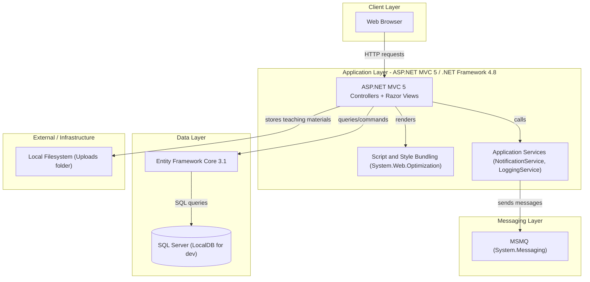
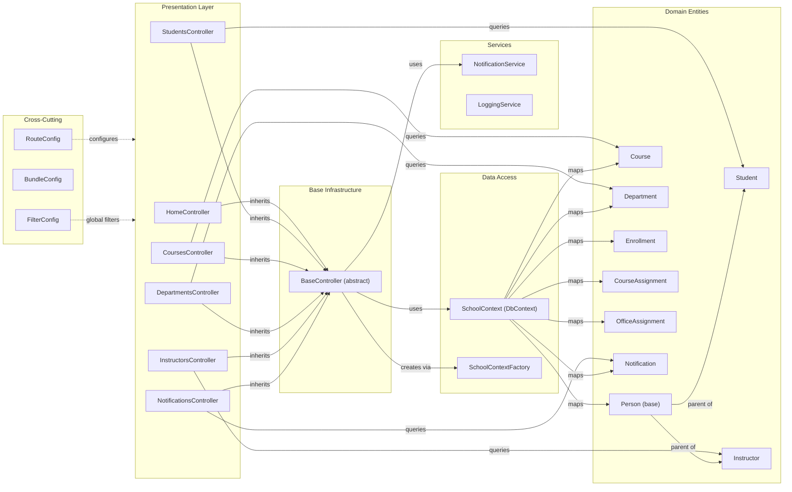

# Architecture Diagram

This document describes the high-level application architecture and the detailed component relationships of the ContosoUniversity ASP.NET MVC 5 web application running on .NET Framework 4.8.

## Application Architecture

### Technology Stack Summary

| Layer | Technology | Version | Purpose |
|---|---|---|---|
| Presentation | ASP.NET MVC 5 | 5.2.9 | Server-side web framework with Razor views |
| Presentation | Razor Views (.cshtml) | 3.2.9 | HTML templating |
| Presentation | Bootstrap | 5.3.3 | Responsive UI framework |
| Presentation | jQuery | 3.7.1 | Client-side scripting |
| Presentation | jQuery Validation | 1.21.0 | Client-side form validation |
| Application | .NET Framework | 4.8 | Runtime platform |
| Application | System.Web.Optimization | 1.1.3 | Script/CSS bundling and minification |
| Data Access | Entity Framework Core | 3.1.32 | ORM for relational data access |
| Data Access | Microsoft.Data.SqlClient | 2.1.4 | SQL Server connectivity |
| Database | SQL Server / LocalDB | N/A | Relational data store |
| Messaging | System.Messaging (MSMQ) | N/A (built-in) | Async notification queue |
| Serialization | Newtonsoft.Json | 13.0.3 | JSON serialization |

### Data Storage & External Services

The application uses a single SQL Server database (LocalDB for development, configurable connection string in Web.config) accessed through Entity Framework Core 3.1. A private MSMQ queue (`.\Private$\ContosoUniversityNotifications`) is used for asynchronous notification messaging — the `NotificationService` writes notifications to the queue on entity create/update/delete operations. Uploaded files (teaching material images) are stored directly on the web server's local filesystem under the `~/Uploads` directory. There are no external third-party API integrations or cloud services.

### Key Architectural Decisions

- **ASP.NET MVC 5 with Razor Views**: Uses a traditional server-side rendered MVC pattern; all HTML is generated on the server and returned to the browser as full pages.
- **Entity Framework Core 3.1 on .NET Framework 4.8**: Unusual hybrid — EF Core is used instead of EF6, providing LINQ-based queries while remaining on the legacy .NET Framework runtime. Table-per-Hierarchy (TPH) inheritance is configured for the `Person` base entity (Student/Instructor discriminator).
- **MSMQ for Notifications**: Fire-and-forget notification messages are queued via MSMQ after each CRUD operation; this is a Windows-only technology and represents a significant cloud migration blocker.

## Component Relationships

### Component Inventory

| Component | Layer | Type | Responsibility |
|---|---|---|---|
| HomeController | Presentation | MVC Controller | Renders home page and statistics (enrollment count by date) |
| StudentsController | Presentation | MVC Controller | CRUD for student records with search and pagination |
| CoursesController | Presentation | MVC Controller | CRUD for courses including teaching material file uploads |
| DepartmentsController | Presentation | MVC Controller | CRUD for academic departments |
| InstructorsController | Presentation | MVC Controller | CRUD for instructors with office and course assignment management |
| NotificationsController | Presentation | MVC Controller | Displays notification log from MSMQ queue |
| BaseController | Base Infrastructure | Abstract MVC Controller | Initialises SchoolContext and NotificationService; sends entity change notifications |
| NotificationService | Services | Service Class | Wraps MSMQ queue operations; serialises/deserialises Notification objects as JSON |
| LoggingService | Services | Service Class | Provides application-level logging to Debug output |
| SchoolContext | Data Access | EF Core DbContext | Defines entity sets and model configuration; TPH for Person hierarchy |
| SchoolContextFactory | Data Access | Factory | Creates SchoolContext with SQL Server connection string from Web.config |
| DbInitializer | Data Access | Seeder | Seeds initial data if the database is empty |
| Person | Domain Entities | Entity (base) | Base class for Student and Instructor with shared identity fields |
| Student | Domain Entities | Entity | Represents a student; derived from Person via TPH |
| Instructor | Domain Entities | Entity | Represents an instructor; derived from Person via TPH |
| Course | Domain Entities | Entity | Academic course with department relationship and file upload path |
| Department | Domain Entities | Entity | Academic department with administrator (Instructor) relationship |
| Enrollment | Domain Entities | Entity | Many-to-many join between Student and Course with grade |
| CourseAssignment | Domain Entities | Entity | Many-to-many join between Course and Instructor (composite key) |
| OfficeAssignment | Domain Entities | Entity | One-to-one relationship between Instructor and office location |
| Notification | Domain Entities | Entity | Notification record stored in MSMQ and optionally in DB |
| RouteConfig | Cross-Cutting | Route Configuration | Defines conventional MVC route pattern {controller}/{action}/{id} |
| BundleConfig | Cross-Cutting | Bundle Configuration | Defines CSS and JS bundles for Bootstrap, jQuery, validation |
| FilterConfig | Cross-Cutting | Filter Configuration | Registers global MVC filters (HandleErrorAttribute) |
| PaginatedList | Utility | Generic Class | Wraps IQueryable results with page-size and page-number pagination |
