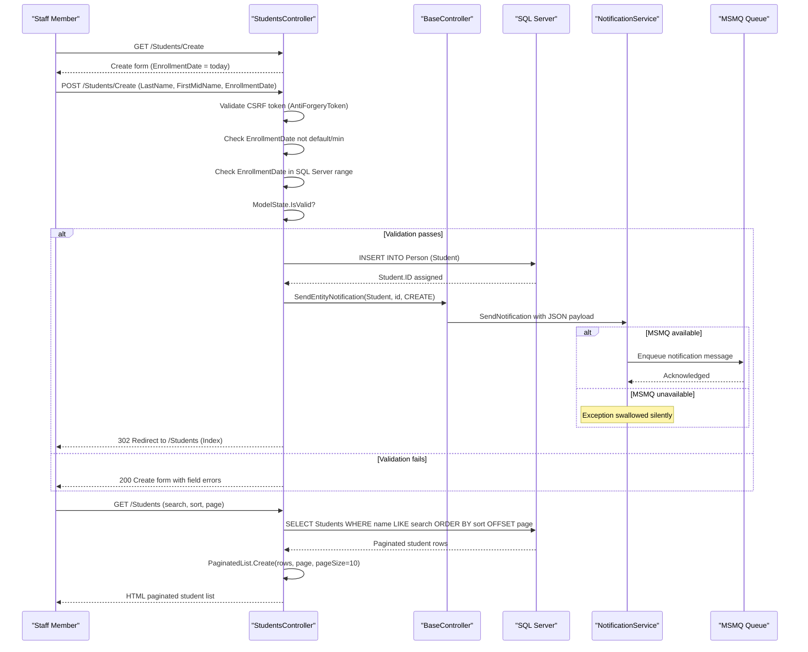

# Core Business Workflows

ContosoUniversity is a university administration web application that allows staff to manage students, instructors, courses, departments, and course enrollments within a single integrated system.

## Domain Entities

| Entity | Bounded Context | Description | Key Relationships |
|---|---|---|---|
| Student | Academic Records | A person enrolled at the university | Has many Enrollments; inherits identity from Person |
| Instructor | Human Resources / Academics | A teaching staff member | Has many CourseAssignments; optionally has one OfficeAssignment; may administer one Department; inherits identity from Person |
| Person | Identity | Abstract base for Student and Instructor (TPH) | Parent of Student and Instructor |
| Course | Curriculum | An academic course offered by a department | Belongs to one Department; has many Enrollments; assigned to many Instructors via CourseAssignment |
| Department | Organisation | An academic department that owns courses | Has many Courses; has one administrator (Instructor) |
| Enrollment | Academic Records | Records a student's participation in a course and their grade | Connects Student and Course; carries optional Grade |
| CourseAssignment | Scheduling | Associates an Instructor with a Course (many-to-many) | Join entity between Instructor and Course |
| OfficeAssignment | Facilities | Records an instructor's office location (optional) | One-to-one with Instructor |
| Notification | Audit / Operations | Records CRUD events sent via MSMQ for audit and operational visibility | Standalone entity; created on any entity create/update/delete |

## Service-to-Domain Mapping

| Service | Domain Context | Owned Entities | External Dependencies |
|---|---|---|---|
| ContosoUniversity Web | University Administration (single bounded context) | All entities (Student, Instructor, Course, Department, Enrollment, CourseAssignment, OfficeAssignment, Notification, Person) | SQL Server (data store), MSMQ (async notifications), Local filesystem (teaching material uploads) |

This is a monolithic application with a single bounded context. There is no service decomposition; all domain logic resides in the MVC controllers and is executed in the same process.

## Primary Workflows

### Workflow 1: Student Enrolment Registration

An administrator registers a new student in the system.

1. Staff navigates to `/Students/Create`.
2. System presents a blank form with `EnrollmentDate` defaulting to today.
3. Staff enters `LastName`, `FirstMidName`, and `EnrollmentDate`.
4. On POST, the system validates:
   - `LastName` and `FirstMidName` required, max 50 characters each.
   - `EnrollmentDate` must not be `DateTime.MinValue` / default.
   - `EnrollmentDate` must be within SQL Server range (1753-01-01 to 9999-12-31).
   - `[Bind]` allow-list limits bound fields to prevent over-posting.
5. If validation passes: student is saved to the database and an async CREATE notification is enqueued to MSMQ.
6. Staff is redirected to the student list.
7. If validation fails: the form is redisplayed with field-level error messages.

### Workflow 2: Instructor Management with Course Assignment

An administrator creates or updates an instructor and assigns them to courses.

1. Staff navigates to `/Instructors/Create` or `/Instructors/Edit/{id}`.
2. System loads all available courses and marks currently assigned ones (`PopulateAssignedCourseData`).
3. Staff fills in instructor identity fields, optional office location, and selects course checkboxes.
4. On POST, `UpdateInstructorCourses` reconciles the submitted `selectedCourses[]` array against existing `CourseAssignment` records:
   - Courses in the submitted list but not currently assigned → new `CourseAssignment` is added.
   - Courses currently assigned but not in the submitted list → existing `CourseAssignment` is deleted (set `EntityState.Deleted`).
5. Office assignment: if `Location` is blank or whitespace, the `OfficeAssignment` record is set to null (deleted).
6. On success: instructor is saved and an UPDATE notification is sent.
7. On delete: if the deleted instructor is the `Administrator` of any department, that department's `InstructorID` is set to null before deletion.

### Workflow 3: Department Budget and Concurrency Management

An administrator edits a department's budget or start date; concurrent edits by multiple users are handled.

1. Staff navigates to `/Departments/Edit/{id}`.
2. System loads the department record, including the `RowVersion` concurrency token.
3. Staff modifies name, budget, start date, or administrator.
4. On POST, EF Core checks the submitted `RowVersion` against the current database value.
5. If `RowVersion` matches: the update proceeds and a notification is enqueued.
6. If `RowVersion` does not match (`DbUpdateConcurrencyException`): the system reloads the current database values, compares them to the submitted values field-by-field, and presents a conflict resolution page showing both versions.

### Workflow 4: Course Creation with Teaching Material Upload

An administrator creates a new course and optionally uploads a teaching material image.

1. Staff navigates to `/Courses/Create`.
2. On POST, if a file is attached:
   - File extension must be one of `.jpg`, `.jpeg`, `.png`, `.gif`, `.bmp` (allow-list validation).
   - File is saved to `~/Uploads/{CourseID}_{timestamp}{ext}` on the server filesystem.
   - The relative path is stored in `Course.TeachingMaterialImagePath`.
3. If no file is attached, `TeachingMaterialImagePath` remains null.
4. `CourseID` is user-supplied (not auto-generated) — the system does not enforce uniqueness beyond the database primary key constraint.
5. On success: course saved and CREATE notification enqueued.

### Workflow 5: Notification Queue Processing

Async notifications generated by CRUD operations are queued and can be viewed by staff.

1. Any successful Create/Update/Delete in any controller triggers `BaseController.SendEntityNotification()`.
2. The notification JSON is serialised and posted to the MSMQ private queue `.\Private$\ContosoUniversityNotifications`.
3. If MSMQ is unavailable, the exception is caught and silently swallowed — the main operation still succeeds.
4. Staff views notifications at `/Notifications`.
5. The `NotificationsController` reads pending messages from the MSMQ queue and displays them (GET) or processes mark-as-read (POST).

## Cross-Service Data Flows

This is a single-process monolith with no inter-service calls. All data flows are intra-process via the shared `SchoolContext`:

- **Instructor Index page** (`/Instructors?id=X&courseID=Y`): A single EF Core query joins Instructors → OfficeAssignments → CourseAssignments → Courses → Enrollments. The response is an `InstructorIndexData` view model aggregating all three levels. No external service calls occur.
- **Home About page** (`/Home/About`): Executes a `GROUP BY EnrollmentDate` aggregation across all students to produce the `EnrollmentDateGroup` statistics. No caching — query runs on every page load.
- **Department deletion cascade**: When an instructor is deleted, a separate query updates all departments that reference that instructor as administrator, nulling the `InstructorID` FK before the delete. This is manual cascade logic in application code.

## Business Workflow Sequence

## Business Rules & Decision Logic

### Validation Rules

| Entity | Rule | Enforcement Point |
|---|---|---|
| Student.LastName | Required; max 50 characters | Model annotation + ModelState |
| Student.FirstMidName | Required; max 50 characters | Model annotation + ModelState |
| Student.EnrollmentDate | Required; not DateTime.MinValue; must be 1753–9999 | Controller custom validation |
| Instructor.HireDate | Required; must be 1753–9999 | Model annotation (Range) |
| Instructor.LastName | Required; max 50 characters | Model annotation |
| Instructor.FirstMidName | Required; max 50 characters | Model annotation |
| Course.Title | Required; 3–50 characters | Model annotation |
| Course.Credits | Range 0–5 | Model annotation |
| Course.TeachingMaterialImagePath | Max 255 characters; file extension must be jpg/jpeg/png/gif/bmp | Controller allow-list |
| Department.Name | Required; 3–50 characters | Model annotation |
| Department.Budget | Money type column; non-negative implied | Model annotation (DataType.Currency) |
| OfficeAssignment.Location | Max 50 characters; blank = no office | Model annotation + controller null-out logic |
| All POST actions | CSRF token required | `[ValidateAntiForgeryToken]` attribute |

### Decision Logic

| Decision Point | Logic | Location |
|---|---|---|
| Course assignment reconciliation | Compare submitted course IDs to existing CourseAssignments; add missing, remove deselected | `InstructorsController.UpdateInstructorCourses()` |
| Office assignment removal | If `OfficeAssignment.Location` is whitespace, set `OfficeAssignment = null` | `InstructorsController.Edit()` |
| Department administrator cleanup | On Instructor delete, null out `Department.InstructorID` for affected departments | `InstructorsController.DeleteConfirmed()` |
| Concurrency conflict | On `DbUpdateConcurrencyException`, reload current values and present conflict UI | `DepartmentsController.Edit()` |
| Notification failure | Catch all exceptions from `NotificationService`; swallow silently; do not fail the main operation | `BaseController.SendEntityNotification()` |
| File upload allowed types | Allow only `.jpg`, `.jpeg`, `.png`, `.gif`, `.bmp` | `CoursesController.Create()` / `Edit()` |

### Cross-Cutting Concerns

| Concern | Implementation | Notes |
|---|---|---|
| Transactions | Implicit EF Core `SaveChanges()` transaction | No explicit `TransactionScope` or `BeginTransaction()` used; each `SaveChanges()` is an atomic operation |
| Error handling | Controller-level try/catch with `ModelState.AddModelError()` | Generic error messages presented to user; technical details logged via `Trace.TraceError()` |
| Audit / Notifications | Fire-and-forget MSMQ message on every CRUD operation | No persistent audit table; notifications are transient queue messages (may be lost if queue is full or unavailable) |
| Authorization | None implemented | All routes are publicly accessible; commented-out global `AuthorizeAttribute` was removed |
| Input binding security | `[Bind(Include = "...")]` allow-lists on all POST actions | Prevents mass-assignment / over-posting of unlisted properties |
| Concurrency control | Optimistic concurrency via `RowVersion` byte array on `Department` entity | Only Department uses row versioning; other entities have no concurrency protection |
