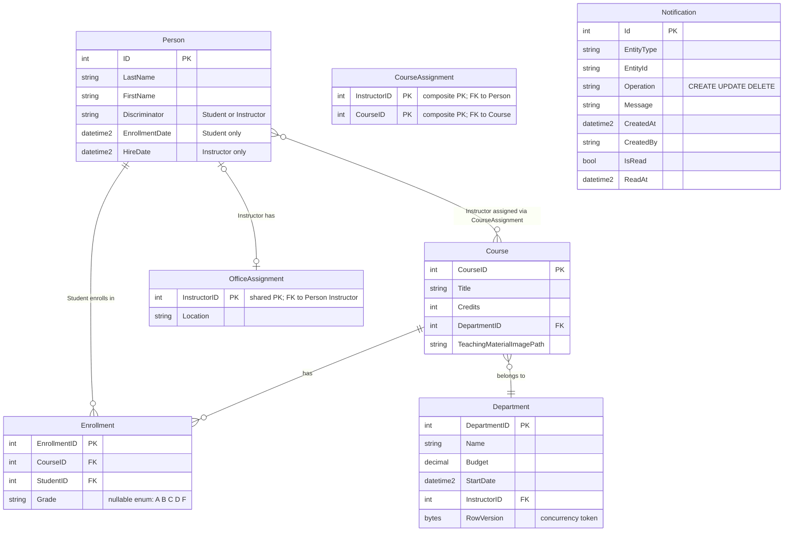

# Data Architecture & Persistence Layer

ContosoUniversity uses a single SQL Server database accessed through Entity Framework Core 3.1 with 9 mapped entities organised around a university domain (students, instructors, courses, departments, and notifications).

## Database Configuration

| Module | DB Type | Environment | Driver | Connection | Migration Tool |
|---|---|---|---|---|---|
| ContosoUniversity | SQL Server (LocalDB) | Development | Microsoft.Data.SqlClient 2.1.4 | LocalDb\MSSQLLocalDB; Initial Catalog: ContosoUniversityNoAuthEFCore | Programmatic seed via DbInitializer (no migration tool) |
| ContosoUniversity | SQL Server | Production | Microsoft.Data.SqlClient 2.1.4 | Connection string in Web.config; replace with environment variable for cloud | No Flyway/Liquibase/EF Migrations configured |

**Schema management**: No EF Core Migrations or third-party migration tool is configured. The database schema is created by EF Core's `EnsureCreated()` called from `DbInitializer.Initialize()` during application startup. `DbInitializer` also seeds reference and test data if the Person table is empty. This approach is not suitable for production use; EF Core Migrations or a dedicated migration tool should be adopted before cloud deployment.

**Seed data**: `DbInitializer.Initialize()` seeds students, instructors, departments, courses, enrollments, course assignments, and office assignments if no people records exist.

## Data Ownership per Service

| Service | Tables Owned | ORM Framework | Caching | Notes |
|---|---|---|---|---|
| ContosoUniversity Web | Person (Student/Instructor TPH), Course, Department, Enrollment, CourseAssignment, OfficeAssignment, Notification | Entity Framework Core 3.1 | None | Single bounded context; no schema separation; all tables in default schema |

## Entity Model

## Key Repository Methods

The application does not use the Repository pattern or Spring Data-style repository interfaces. All data access is performed directly via `SchoolContext` (EF Core `DbContext`) from within the controller actions. Notable query patterns are:

| Controller | Access Pattern | Key Query | Purpose |
|---|---|---|---|
| StudentsController.Index | `db.Students.Where(...).OrderBy(...)` | Filter by LastName/FirstMidName containing search string, order by various columns | Paginated student list with search and sort |
| StudentsController.Details | `db.Students.Include(s => s.Enrollments).ThenInclude(e => e.Course)` | Eager-load enrollments with course data | Student detail view |
| InstructorsController.Index | `db.Instructors.Include(Courses).Include(OfficeAssignment).Include(CourseAssignments.Enrollment)` | Multi-level eager load for instructor selection panel | Instructor index with optional course/enrollment details |
| CoursesController | `db.Courses.Include(c => c.Department)` | Eager-load department for course list | Course display with department name |
| DepartmentsController.Edit | EF optimistic concurrency via `RowVersion` byte array | Catches `DbUpdateConcurrencyException` and presents conflict values | Concurrency conflict handling |
| HomeController.About | `db.Students.GroupBy(s => s.EnrollmentDate).Select(...)` | Group-by aggregation for enrollment statistics | Home page statistics chart |
| SchoolContext.OnModelCreating | `modelBuilder.Entity<CourseAssignment>().HasKey(c => new { c.CourseID, c.InstructorID })` | Composite key configuration | Join table without surrogate key |

## Caching Strategy

No caching layer is implemented. All queries execute directly against SQL Server on every request with no in-memory, distributed, or query-result caching. There is no use of `IMemoryCache`, `IDistributedCache`, `[OutputCache]`, EF Core second-level cache, or any third-party caching library.

**Recommendation**: For cloud deployment, consider:
- `IMemoryCache` or `IDistributedCache` (Azure Cache for Redis) for reference data (departments, courses) that changes infrequently.
- EF Core compiled queries for the most frequently executed queries.
- Output caching on read-only pages (course list, home statistics).

## Data Ownership Boundaries

The application uses a **shared single database** with a single bounded context (`SchoolContext`). There is no schema separation, database-per-service, or logical partitioning.

**TPH Inheritance**: `Person` is the base table for both `Student` and `Instructor` using Table-per-Hierarchy (TPH) with a `Discriminator` string column. This means both entity types share the same `Person` table; columns specific to one type are nullable for the other.

**Cross-entity access**: Controllers access all entities through the single shared `SchoolContext`. There are no cross-service REST calls or event-driven data sync patterns; all reads and writes happen within the same database transaction context.

**Read/write pattern**: All operations are synchronous read/write CRUD. No CQRS, event sourcing, or read-replica pattern is in use.

### Data Classification & Sensitivity

| Entity | Sensitive Fields | Classification | Controls in Place |
|---|---|---|---|
| Person (Student) | LastName, FirstMidName, EnrollmentDate | PII | None — no encryption-at-rest, no masking, no field-level access control |
| Person (Instructor) | LastName, FirstMidName, HireDate | PII | None — same as above |
| OfficeAssignment | Location (office location) | Low sensitivity | None |
| Department | Name, Budget, StartDate | Internal business data | None |
| Course | Title, Credits, TeachingMaterialImagePath | Internal | None |
| Enrollment | Grade | Academic record (PII-adjacent) | None — no encryption or access control |
| Notification | EntityType, EntityId, Message, CreatedBy | Operational / audit | None — stored in DB and MSMQ with no access restriction |

**Summary**: Student and instructor personal information (names, dates) is stored without encryption-at-rest, data masking, or column-level access controls. Academic grades are stored in plain text. For GDPR/FERPA or similar regulatory compliance, encryption-at-rest on SQL Server (Transparent Data Encryption), column-level encryption for PII fields, and role-based access controls should be implemented before production deployment.
