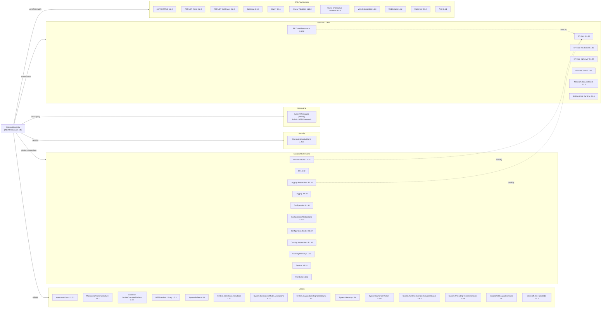

# Dependency Map

ContosoUniversity is an ASP.NET MVC 5 web application targeting .NET Framework 4.8 with 46 declared NuGet dependencies across web, data access, messaging, security, and utility categories.

## Dependencies

### Dependency Summary

| Category | Count | Key Libraries | Notes |
|---|---|---|---|
| Web Frameworks | 11 | ASP.NET MVC 5.2.9, Bootstrap 5.3.3, jQuery 3.7.1, Web.Optimization 1.1.3 | Legacy MVC stack; System.Web not compatible with .NET Core |
| Database / ORM | 7 | EF Core 3.1.32 (EOL), Microsoft.Data.SqlClient 2.1.4 | EF Core 3.1 is end-of-life since Dec 2022 |
| Messaging | 1 | System.Messaging (MSMQ) — built-in | Windows-only; not available on .NET Core; major migration blocker |
| Security | 1 | Microsoft.Identity.Client 4.21.1 | MSAL present but no auth is implemented |
| Microsoft.Extensions | 11 | DI, Logging, Configuration, Caching, Options 3.1.32 | All at EOL 3.1.32; must be upgraded |
| Utilities | 14 | Newtonsoft.Json 13.0.3, System.Memory 4.5.4, NETStandard.Library 2.0.3 | Several polyfill packages only needed on .NET Framework |

### Version & Compatibility Risks

The most significant risk is the **ASP.NET MVC 5 / System.Web dependency** — the entire web stack (System.Web.Mvc, System.Web.Optimization, System.Web.Routing) is incompatible with .NET Core and must be replaced with ASP.NET Core MVC. **Entity Framework Core 3.1** reached end-of-life in December 2022 and does not receive security patches; it must be upgraded to EF Core 8.x or later. All **Microsoft.Extensions.*** packages (DI, Logging, Configuration, Caching) are at version 3.1.32 — also EOL. **System.Messaging (MSMQ)** is a Windows-only built-in .NET Framework library with no .NET Core equivalent; migration to Azure Service Bus or another cloud messaging service is required. **Microsoft.Data.SqlClient 2.1.4** is several major versions behind the current 5.x release and has known CVE vulnerabilities. **Modernizr 2.6.2** is significantly outdated (last release 2013) and may contain security issues; consider removing it.

### Notable Observations

- **MSAL installed but unused**: `Microsoft.Identity.Client 4.21.1` is declared as a dependency but the application implements no authentication or authorization — all routes are anonymous. This library should either be activated or removed.
- **Polyfill packages can be removed after .NET migration**: Packages like `System.Buffers`, `System.Memory`, `System.Threading.Tasks.Extensions`, `Microsoft.Bcl.AsyncInterfaces`, and `System.Numerics.Vectors` are backports for .NET Framework compatibility and are built-in on .NET 5+. They can be removed after migration.
- **NETStandard.Library 2.0.3 as explicit dependency**: This is a meta-package that should not typically be referenced directly in .NET Framework projects; it indicates a non-standard setup.
- **No dedicated logging library declared**: The project uses custom `LoggingService` wrapping `System.Diagnostics.Debug.WriteLine` but no structured logging library (Serilog, NLog, Microsoft.Extensions.Logging providers) is declared.

## Test Dependencies

No test project or test-scoped dependencies were detected in the solution.

Total test-scope dependencies: 0

The solution contains no test project and no test framework references (xUnit, NUnit, MSTest, etc.). Adding a test project with unit and integration tests is strongly recommended before beginning the modernization effort.
