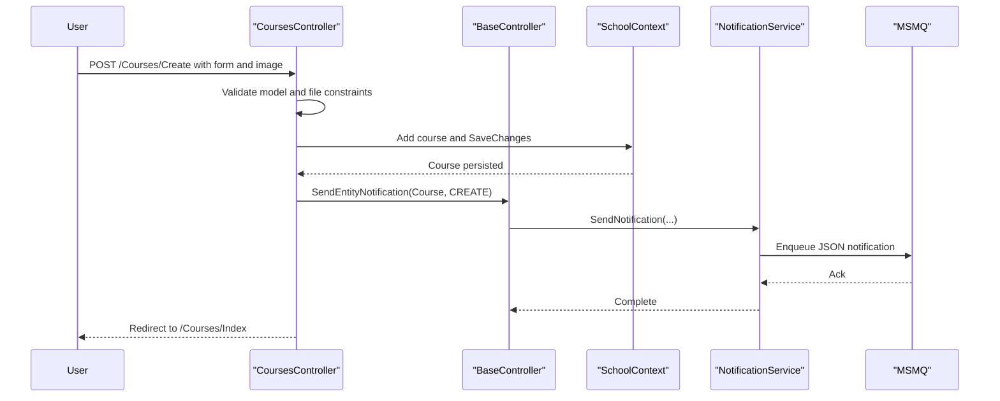

# API & Service Communication Contracts

This application exposes a server-rendered MVC surface with JSON endpoints for notifications and standard controller actions for domain CRUD operations.

## Service Catalog

| Service | Port | Category | Purpose |
|---|---|---|---|
| ContosoUniversity (single web app) | 44300 (IIS Express) | API Layer + Business | Serves UI, processes domain workflows, and emits notifications |

## API Endpoints Inventory

| Service | Method | Path | Request Type | Response Type |
|---|---|---|---|---|
| ContosoUniversity | GET | /Students/Index | Query params (`sortOrder`,`searchString`,`page`) | Razor View |
| ContosoUniversity | GET | /Students/Details/{id} | Path id | Razor View |
| ContosoUniversity | POST | /Students/Create | Form fields mapped to `Student` | Redirect / validation errors |
| ContosoUniversity | POST | /Students/Edit | Form fields mapped to `Student` | Redirect / validation errors |
| ContosoUniversity | POST | /Students/Delete/{id} | Path id | Redirect |
| ContosoUniversity | GET | /Courses/Index | None | Razor View |
| ContosoUniversity | POST | /Courses/Create | `Course` form + file upload (`HttpPostedFileBase`) | Redirect / validation errors |
| ContosoUniversity | POST | /Courses/Edit | `Course` form + optional file upload | Redirect / validation errors |
| ContosoUniversity | POST | /Courses/Delete/{id} | Path id | Redirect |
| ContosoUniversity | GET | /Departments/Index | None | Razor View |
| ContosoUniversity | POST | /Departments/Create | `Department` form | Redirect / validation errors |
| ContosoUniversity | POST | /Departments/Edit | `Department` form + row version | Redirect / validation errors |
| ContosoUniversity | POST | /Departments/Delete/{id} | Path id | Redirect |
| ContosoUniversity | GET | /Instructors/Index | Query ids | Razor View |
| ContosoUniversity | POST | /Instructors/Create | `Instructor` + selected course ids | Redirect / validation errors |
| ContosoUniversity | POST | /Instructors/Edit/{id} | Form + selected course ids | Redirect / validation errors |
| ContosoUniversity | POST | /Instructors/Delete/{id} | Path id | Redirect |
| ContosoUniversity | GET | /Notifications/GetNotifications | None | JSON list of `Notification` |
| ContosoUniversity | POST | /Notifications/MarkAsRead | Form/query `id` | JSON success response |

## Management & Observability Endpoints

| Service | Endpoint | Custom Metrics (if any) |
|---|---|---|
| ContosoUniversity | No dedicated management endpoints detected | None |

## DTOs & Contracts

The application primarily uses domain entities (`Student`, `Course`, `Instructor`, `Department`, `Notification`) as request/response models in MVC actions. There is no separate gateway-level aggregation DTO layer. JSON serialization in notification APIs uses `Newtonsoft.Json`. No OpenAPI, Swagger, protobuf, or GraphQL contract files were detected.

## Communication Patterns

Communication is mostly synchronous in-process controller-to-EF operations. Notification behavior adds asynchronous queuing through MSMQ (`NotificationService` send/receive). No circuit-breaker or retry library usage was detected. Service discovery and gateway composition are not present because this is a single deployable web application. API-level authentication/authorization/TLS enforcement is not implemented in controller code; comments indicate default system user behavior and removed global authorization filter.

## Service Technology Matrix

| Service | Web | Data Access | Discovery | Gateway | Actuator | Cache | Metrics |
|---|---|---|---|---|---|---|---|
| ContosoUniversity | ASP.NET MVC 5 | EF Core 3.1 + SQL Server | none | none | none | Memory cache libs referenced | none |

## Service Communication Sequence

