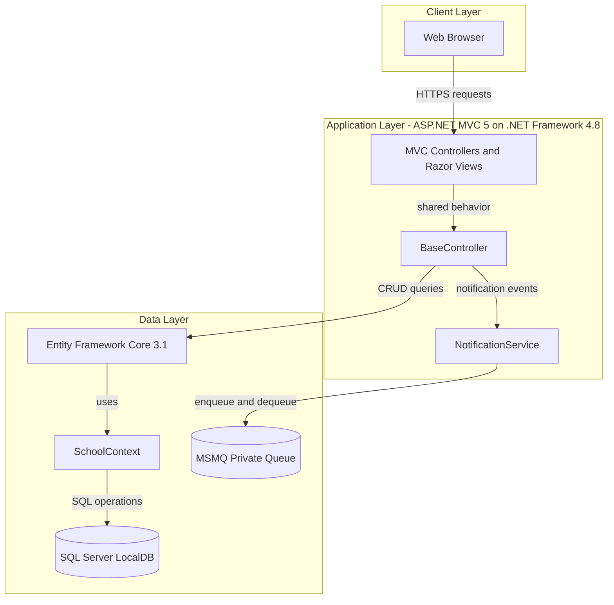
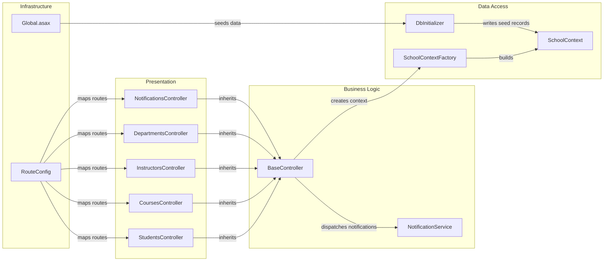

# Architecture Diagram

This document summarizes the current ContosoUniversity application architecture and the key internal component interactions.

## Application Architecture

### Technology Stack Summary

| Layer | Technology | Version | Purpose |
|---|---|---|---|
| Presentation | ASP.NET MVC + Razor | 5.2.9 | Server-rendered UI and request routing |
| Business Logic | MVC Controllers + BaseController | n/a | Coordinate CRUD workflows and notifications |
| Data Access | Entity Framework Core | 3.1.32 | ORM and query abstraction |
| Database | SQL Server LocalDB | MSSQLLocalDB | Persistent storage for domain entities |
| Messaging | System.Messaging (MSMQ) | .NET Framework | Notification queue handling |

### Data Storage & External Services

The application stores domain data in SQL Server LocalDB via `SchoolContext`. It also uses MSMQ private queues for notification messages and does not show third-party HTTP API integrations.

### Key Architectural Decisions

- Uses server-rendered MVC pattern with controller-driven orchestration.
- Uses a shared `BaseController` to centralize data context and notification dispatch.
- Uses EF Core with SQL Server and TPH inheritance for `Person` hierarchy.

## Component Relationships

### Component Inventory

| Component | Layer | Type | Responsibility |
|---|---|---|---|
| StudentsController | Presentation | MVC Controller | Student listing/search CRUD and notifications |
| CoursesController | Presentation | MVC Controller | Course CRUD and teaching material uploads |
| InstructorsController | Presentation | MVC Controller | Instructor CRUD and course assignment updates |
| DepartmentsController | Presentation | MVC Controller | Department CRUD with concurrency handling |
| NotificationsController | Presentation | MVC Controller | Returns queue notifications and marks as read |
| BaseController | Business Logic | Base Controller | Shared context creation and notification dispatch |
| NotificationService | Business Logic | Service | MSMQ send/receive operations |
| SchoolContext | Data Access | DbContext | Entity mapping and persistence |
| SchoolContextFactory | Data Access | Factory | Constructs DbContext from config |
| DbInitializer | Data Access | Initializer | Creates and seeds initial data |
