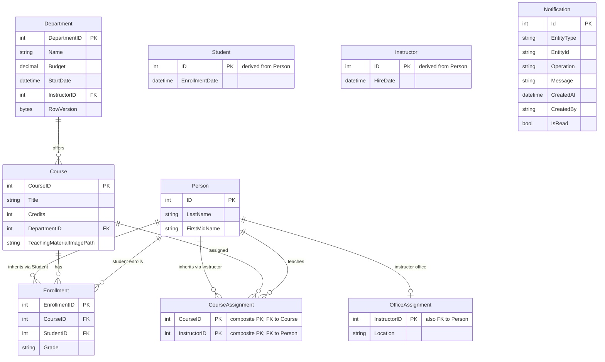

# Data Architecture & Persistence Layer

The data layer is centered on a single EF Core `DbContext` with SQL Server storage for university entities and notification records.

## Database Configuration

| Service/Module | DB Type | Profile | Driver | Connection | Migration Tool |
|---|---|---|---|---|---|
| ContosoUniversity | SQL Server LocalDB | default | Microsoft.Data.SqlClient 2.1.4 | `DefaultConnection` in `Web.config` | None detected (EnsureCreated + seed initializer) |

## Data Ownership per Service

| Service | Tables Owned | ORM Framework | Caching | Notes |
|---|---|---|---|---|
| ContosoUniversity | Person, Course, Department, Enrollment, OfficeAssignment, CourseAssignment, Notification | EF Core 3.1 | In-process cache libraries referenced | Single schema, single bounded context |

## Entity Model

## Key Repository Methods

| Service | Repository | Notable Methods | Purpose |
|---|---|---|---|
| ContosoUniversity | `SchoolContext` (DbContext) | `DbSet<T>` CRUD accessors | Central data manager for all entities |
| ContosoUniversity | `DbInitializer` | `Initialize`, conditional `Any`, batched inserts | Creates schema and seeds baseline data |
| ContosoUniversity | Controllers using LINQ | `Include`, `ThenInclude`, `Where`, `SingleOrDefault` | Query composition and relationship loading |

## Caching Strategy

No explicit cache-aside/read-through policy implementation was found in application logic. `Microsoft.Extensions.Caching.Memory` is referenced in dependencies, but no direct `IMemoryCache` usage was identified in source.

## Data Ownership Boundaries

All entities are managed by one web application and one SQL database. There is no service-to-service database ownership split. Cross-context access is in-process between controllers and DbContext only; no CQRS partitioning was detected.

### Data Classification & Sensitivity

| Entity | Sensitive Fields | Classification (PII/PHI/PCI/None) | Controls in Place |
|---|---|---|---|
| Person (Student/Instructor) | FirstMidName, LastName | PII | No explicit field masking or encryption logic in code |
| Department | Administrator reference | None | Standard DB access controls only |
| Notification | CreatedBy, Message | Potential PII | No explicit masking/encryption in notification payloads |
| Enrollment/Course | Academic metadata | None | Standard ORM access |
