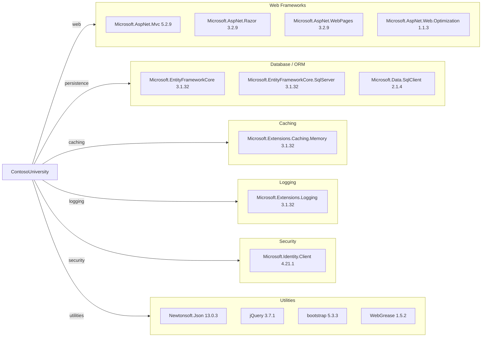

# Dependency Map

This dependency map summarizes the declared NuGet dependencies for ContosoUniversity and groups them by functional role.

## Dependencies

### Dependency Summary

| Category | Count | Key Libraries | Notes |
|---|---:|---|---|
| Web Frameworks | 4 | Microsoft.AspNet.Mvc, Razor, WebPages | Classic ASP.NET MVC stack |
| Database / ORM | 3 | EF Core, EF Core SqlServer, SqlClient | EF Core 3.1 with SQL Server provider |
| Caching | 1 | Microsoft.Extensions.Caching.Memory | In-process cache abstraction available |
| Logging | 1 | Microsoft.Extensions.Logging | Logging primitives included |
| Security | 1 | Microsoft.Identity.Client | Identity client library present |
| Utilities | 4 | Newtonsoft.Json, jQuery, bootstrap, WebGrease | UI/runtime utilities |

### Version & Compatibility Risks

The application targets .NET Framework 4.8 and relies on several older libraries (for example EF Core 3.1 and ASP.NET MVC 5.x) that are out of mainstream innovation paths and may require upgrades for long-term support and modernization.

### Notable Observations

- Mixes classic ASP.NET MVC packages with EF Core 3.1 data access libraries.
- Uses packages.config dependency management rather than SDK-style `PackageReference`.
- Includes front-end packages directly in NuGet package graph.
- SQL connectivity relies on `Microsoft.Data.SqlClient` 2.x runtime binaries.

## Test Dependencies

| Framework | Version | Notes |
|---|---|---|
| N/A | N/A | No test-scoped dependency declarations detected in `packages.config` |

Total test-scope dependencies: 0

No test dependencies detected.
